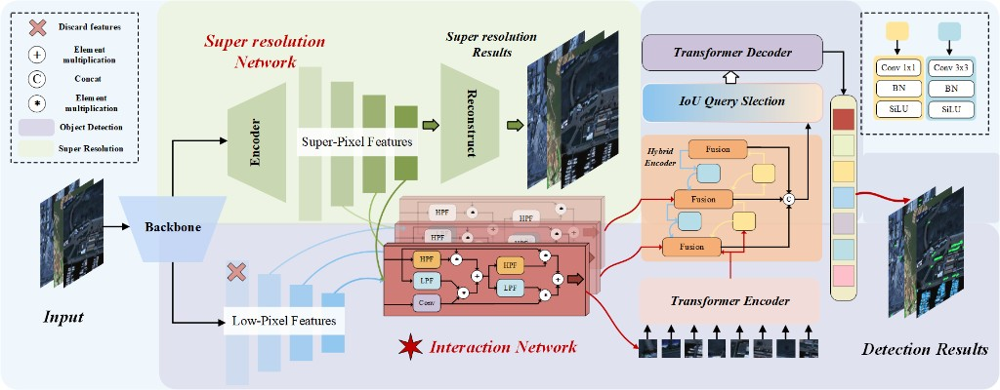
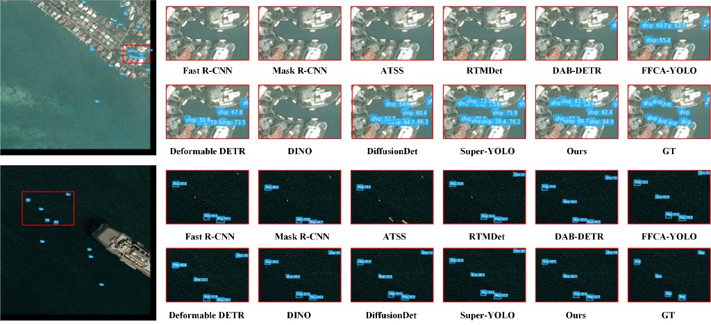
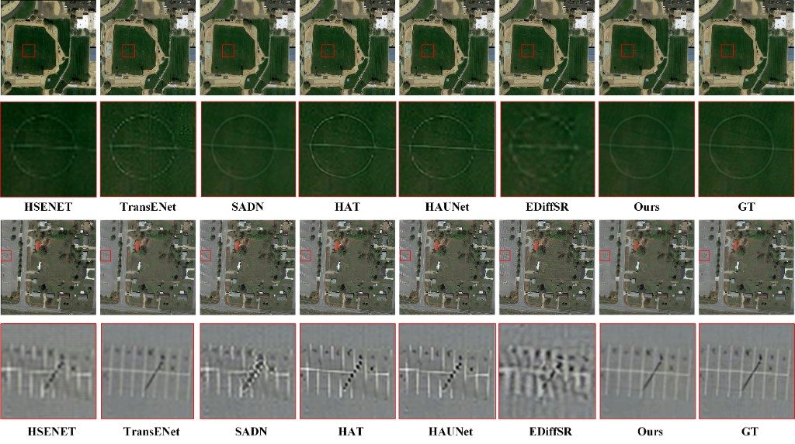

# RT-DETRv2 with Super-Resolution Branch (Super)

PyTorch implementation extending **[RT-DETRv2](https://github.com/lyuwenyu/RT-DETR)** with an **SR (super-resolution) branch** and **multi-scale fusion**, trained with auxiliary **Superloss** for detection (e.g. on AI-TOD / COCO-style setups).

---


---

## Network architecture



---

## Experimental results (qualitative)


### 检测对比（Detection_Sprase）



### 超分辨率对比（Super_resolution对比图2）



---

## Quick start

### Environment

Python 3.x + PyTorch (CUDA recommended). Install dependencies according to your RT-DETR / PyTorch version.

### Train

```bash
torchrun --nproc_per_node=4 tools/train.py -c configs/rtdetrv2/rtdetrv2_r50vd_super.yml
```

### Config paths

配置与输出目录在 YAML 中请使用**相对仓库根目录的路径**（或环境变量），避免写死本机绝对路径。

---

## Project layout (core)

```
assets/                    # README 配图：Framework.png 与实验对比 PNG
configs/rtdetrv2/          # YAML configs (super variant)
src/zoo/rtdetr/            # RTDETR, decoder, criterion (Superloss)
src/SR/                    # Super-resolution branch
tools/                     # train.py, export_onnx.py, …
```

---

## Acknowledgments

Built on [RT-DETR / RT-DETRv2](https://github.com/lyuwenyu/RT-DETR) by lyuwenyu et al.

---

## License

Follow the license terms of the original RT-DETR project and third-party dependencies used in your environment.
