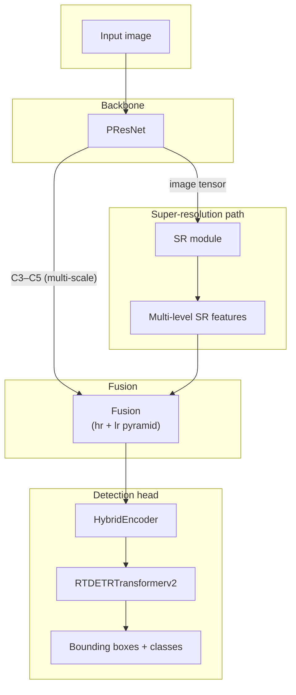

# RT-DETRv2 with Super-Resolution Branch (Super)

PyTorch implementation extending **[RT-DETRv2](https://github.com/lyuwenyu/RT-DETR)** with an **SR (super-resolution) branch** and **multi-scale fusion**, trained with auxiliary **Superloss** for detection (e.g. on AI-TOD / COCO-style setups).

---

## Overview

| Item | Description |
|------|-------------|
| **Detector** | RT-DETR v2 (`RTDETRTransformerv2` + `HybridEncoder`) |
| **Backbone** | PResNet-50vd (configurable) |
| **Extra modules** | `SR` → high-frequency feature stream; `Fusion` merges SR features with backbone pyramids |
| **Loss** | `RTDETRCriterionv2` with `Superloss` (see config `weight_dict`) |

---

## Network architecture

### Diagram (Mermaid)

> GitHub renders this directly in the README.



### Vector figure (optional)

For papers or slides you can use the SVG under `docs/assets/architecture.svg` or export it to PNG.

<p align="center">
  
</p>

---

## Experimental comparisons

定性实验对比图放在仓库内以下**相对路径**（相对于本 README 所在目录），推送到 GitHub 后即可在主页显示。

| 内容 | 相对路径 |
|------|----------|
| 稀疏 / 小目标检测对比 | `docs/assets/Detection_Sprase.png` |
| 超分辨率方法对比（图 2） | `docs/assets/Super_resolution对比图2.png` |

<p align="center">
  <b>检测对比（Detection_Sprase）</b><br/>
  <br/><br/>
  <b>超分辨率对比（Super_resolution对比图2）</b><br/>
  
</p>

---

## Quick start

### Environment

Python 3.x + PyTorch (CUDA recommended). Install dependencies according to your RT-DETR / PyTorch version.

### Train

```bash
torchrun --nproc_per_node=4 tools/train.py -c configs/rtdetrv2/rtdetrv2_r50vd_super.yml
```

### Config paths

配置与输出目录在 YAML 中请使用**相对仓库根目录的路径**（或环境变量），避免写死本机绝对路径。

---

## Project layout (core)

```
configs/rtdetrv2/          # YAML configs (super variant)
src/zoo/rtdetr/            # RTDETR, decoder, criterion (Superloss)
src/SR/                    # Super-resolution branch
tools/                     # train.py, export_onnx.py, …
```

---

## Acknowledgments

Built on [RT-DETR / RT-DETRv2](https://github.com/lyuwenyu/RT-DETR) by lyuwenyu et al.

---

## License

Follow the license terms of the original RT-DETR project and third-party dependencies used in your environment.
